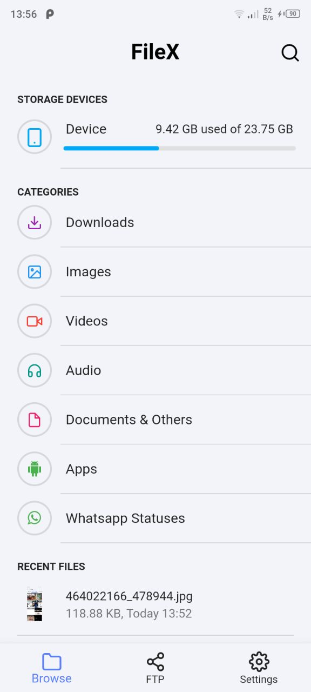
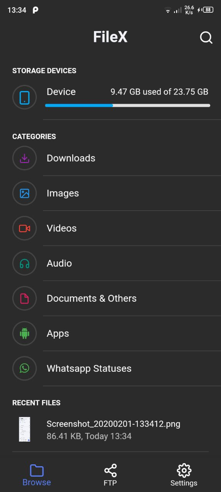
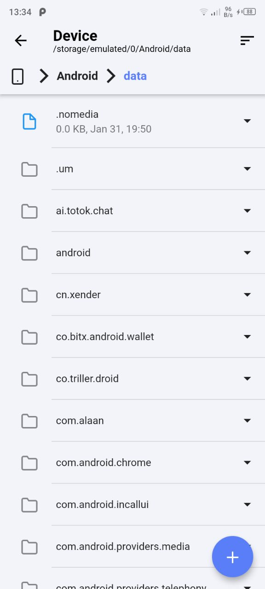
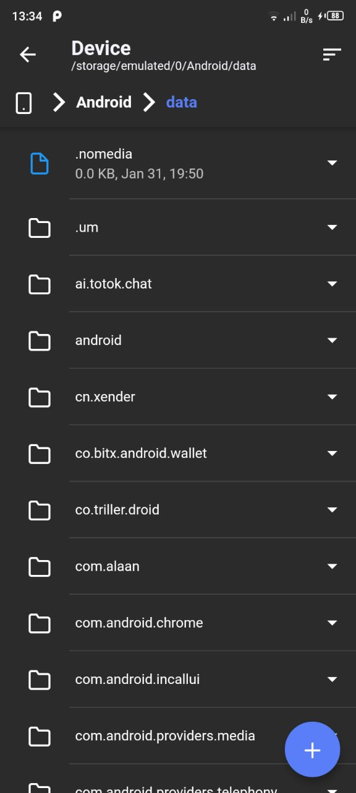
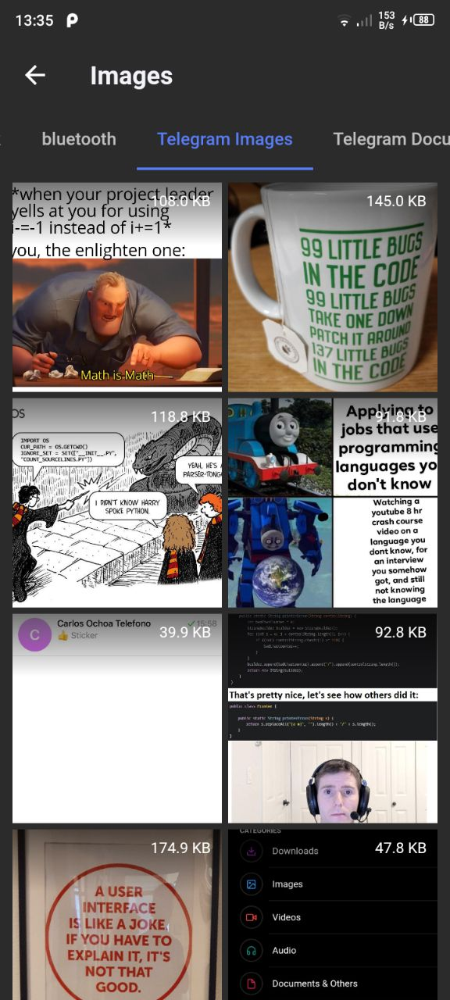
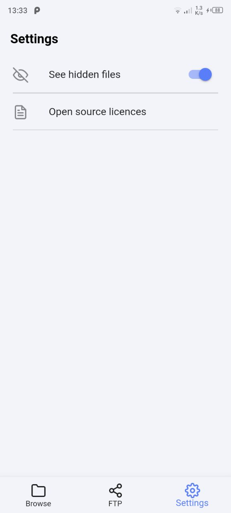
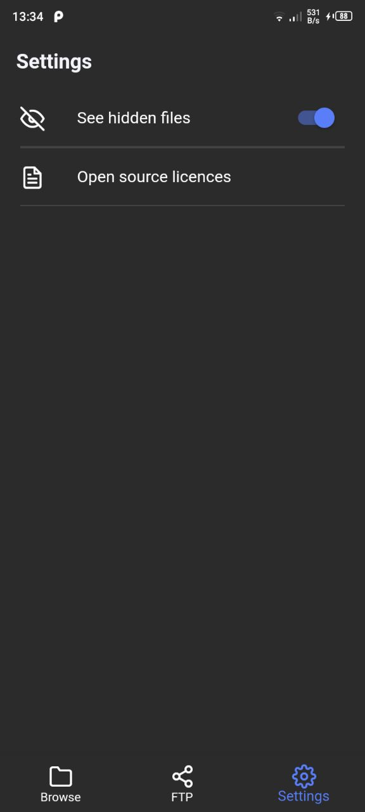

# FileX (WIP)   

A simple File Explorer(Still very buggy) made with Flutter.
 
 
To download apk: 
- Tap on the button below(it will take you to another page)
- Scroll down the page to download `apk-release.apk`
 
<a href="https://codemagic.io/apps/5e35805fcb1395555366758b/5e35805fcb1395555366758a/latest_build"></img></a>
 

## 💻 Requirements
* Any Operating System (ie. MacOS X, Linux, Windows)
* Any IDE with Flutter SDK installed (ie. IntelliJ, Android Studio, VSCode etc)
* A little knowledge of Dart and Flutter
* A brain to think 🤓🤓

## ✨ Features
- [x] Recent Files.
- [x] Search Files.
- [x] Sort Files.
- [x] Show/Hide Hidden files.
- [ ] Copy/Move/Paste Files.
- [x] Delete Files/Folders.
- [x] Rename Files/Folders.
- [x] Dark Mode.
- [ ] FTP.
- [x] Whatsapp Status Saver.

## 📸 ScreenShots

| Light| Dark|
|------|-------|
|||
|||
|||
|||

## 🔌 Plugins
| Name | Usage |
|------|-------|
|[**Provider**](https://pub.dev/packages/provider)| State Management|
|[**Open File**](https://pub.dev/packages/open_file)| To open files Natively|
|[**Device Apps**](https://pub.dev/packages/device_apps)| Get list of apps installed on Device|
|[**Mime Type**](https://pub.dev/packages/mime_type)| Get mime type of a file|
|[**Video Player**](https://pub.dev/packages/video_player)| Get thumbnail from a video file|

## 🤓 Author(s)
**Olusegun Festus Babajide** 

## 🔖 LICENCE
[Apache-2.0](https://github.com/JideGuru/FlutterEbookApp/blob/master/LICENSE)
